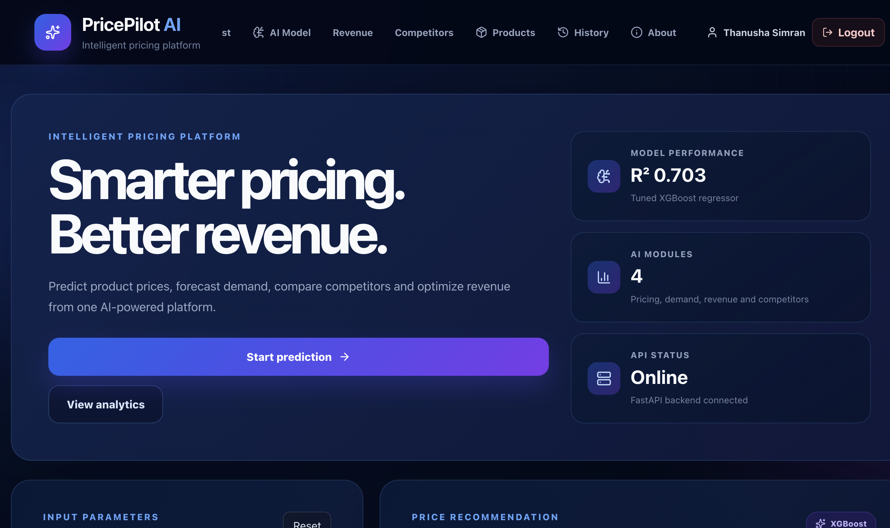
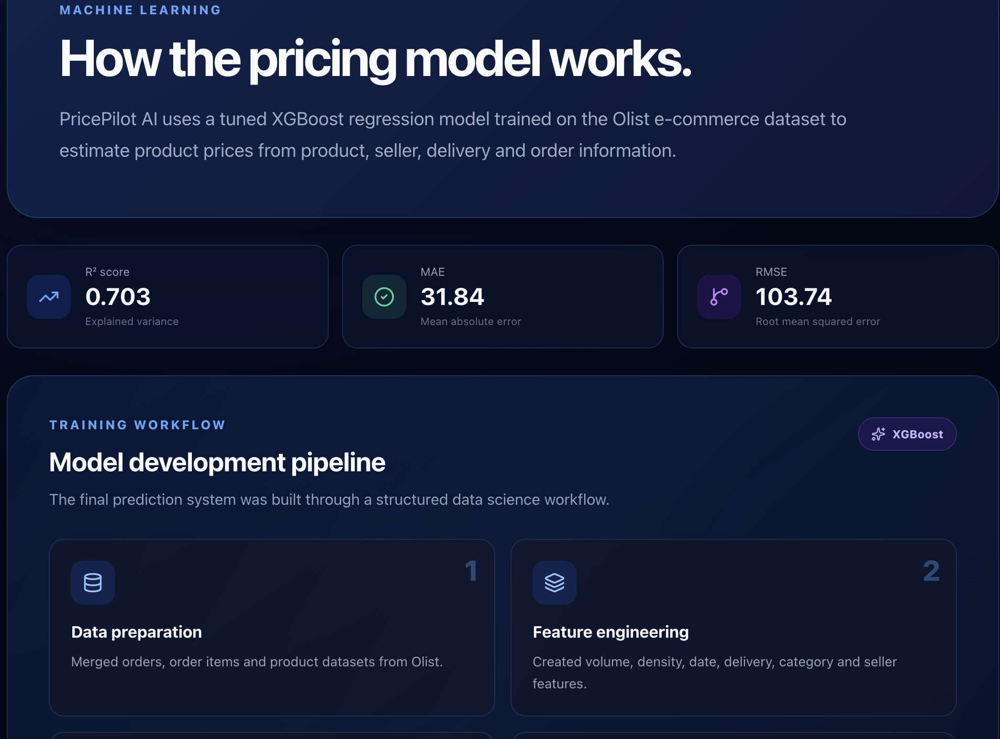
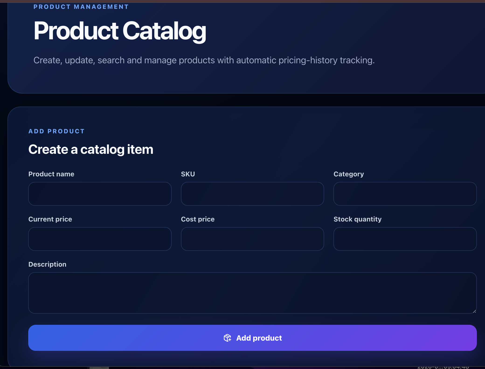

# 🚀 PricePilot AI

## Dynamic Pricing Optimization & Revenue Intelligence System for E-Commerce

> **PricePilot AI** is an AI/ML-powered full-stack web application designed to support data-driven pricing decisions in e-commerce through **price prediction, demand forecasting, competitor analysis, revenue optimization, and business intelligence**.

---

## 📌 Project Overview

E-commerce businesses frequently need to determine the right price for their products while considering product characteristics, historical sales behaviour, demand trends, market conditions, and competitive pricing.

Traditional pricing approaches often rely on manual decisions, static rules, or historical intuition. These approaches may not respond effectively to changing demand and market conditions.

**PricePilot AI** addresses this problem by bringing multiple analytical and machine-learning capabilities together in a single platform.

The system provides:

- 🤖 AI-based price prediction
- 📈 Demand forecasting
- 🏪 Competitor and market analysis
- 💰 Revenue optimization
- 📊 Business analytics
- 📦 Product management
- 🔐 User authentication
- 📜 Prediction history
- 🎯 Pricing decision support

---

# 🎯 Project Objectives

The main objectives of PricePilot AI are:

1. Develop an intelligent price prediction system.
2. Analyse historical e-commerce data.
3. Forecast future product demand.
4. Analyse competitive market positioning.
5. Estimate revenue and profitability under different pricing scenarios.
6. Generate pricing recommendations.
7. Integrate machine learning models into a usable web application.
8. Provide a full-stack platform for pricing and revenue intelligence.

---

# ✨ Key Features

| Feature | Description |
|---|---|
| 🔐 Authentication | User registration and login |
| 📦 Product Management | Product-level information and management |
| 💵 Price Prediction | Machine-learning-based price prediction |
| 🤖 AI Model | Model and AI-related analytics |
| 📈 Demand Forecasting | Future demand analysis and forecasting |
| 📊 Analytics | Product and business analytics |
| 🏪 Competitor Analysis | Market benchmark and competitive positioning |
| 💰 Revenue Optimization | Revenue and profitability analysis |
| 📜 History | Historical prediction information |
| 🏠 Dashboard | Central business intelligence dashboard |
| ℹ️ About | Project and application information |

---

# 🖥️ Application Screenshots

## 🔐 Login

The login interface allows registered users to access the PricePilot AI platform.


---

## 🏠 Main Dashboard

The main dashboard provides an overview of the application's major business intelligence capabilities.



---

## 📊 Analytics

The Analytics section provides visual insights into the available product and business data.


---

## 📈 Demand Forecasting

The Forecast module provides demand-related predictions and visual analysis to support pricing decisions.


---

## 🤖 AI Model

The AI Model section presents machine-learning-related information and model analysis.



---

## 💰 Revenue Optimization

The Revenue module supports analysis of revenue, profitability, and pricing scenarios.


---

## 🏪 Competitor Analysis

The Competitors module provides market-oriented pricing and competitive-position analysis.


---

## 📦 Product Management

The Products section provides product-level management and information.



---

## ℹ️ About

The About section provides information about the PricePilot AI platform.


---

# 🏗️ System Architecture

PricePilot AI follows a full-stack architecture consisting of a React frontend, FastAPI backend, database layer, and machine-learning components.

```text
                         ┌───────────────────┐
                         │       USER        │
                         └─────────┬─────────┘
                                   │
                                   ▼
                         ┌───────────────────┐
                         │   React + Vite    │
                         │     Frontend      │
                         └─────────┬─────────┘
                                   │
                              HTTP / REST
                                   │
                                   ▼
                         ┌───────────────────┐
                         │   FastAPI Backend  │
                         └─────────┬─────────┘
                                   │
             ┌─────────────────────┼─────────────────────┐
             │                     │                     │
             ▼                     ▼                     ▼
      Authentication          ML Services          Business Logic
             │                     │                     │
             │             ┌───────┼────────┐            │
             │             │       │        │            │
             │             ▼       ▼        ▼            │
             │           Price   Demand   Analytics      │
             │         Prediction Forecasting             │
             │                                           │
             └─────────────────────┬─────────────────────┘
                                   │
                                   ▼
                         ┌───────────────────┐
                         │ Database + Model  │
                         │    Artifacts      │
                         └───────────────────┘